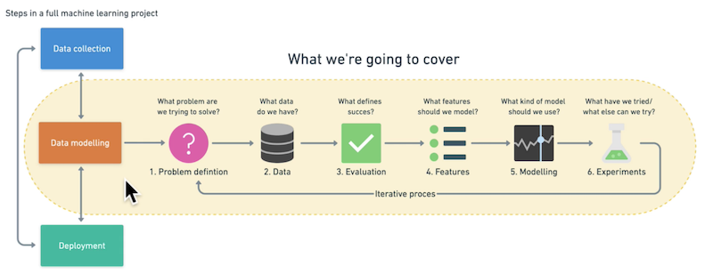

AI/Machine Learning/Data Science
-----

**Types of Machine Learning:**
* Supervised -> Data + Labels
   - Classification (one thing or another)
   - Regression (predict numbers)
* Unsupervised -> Data
   - Grouping (clustering) like music recommendations
* Transfer -> Model (used to build another model)
* Reinforcement

Machine Learning Framework
-----

**Types of Data:**
* structured (csv, excel)
* unstructured (images, text, audio)
* static
* streaming

**Types of Evaluation:**  
_Classification_ -> accuracy, precision, recall  
_Regression_ -> mean absolute error (MAE), mean squared error (MSE), root mean squared error (RMSE)  
_Recommendation_ - > precision at k  

**Features in Data:**  
"What do we already know about data?"  
Feature variables -> Target variables

* Numerical Features
* Categorical Features
* Derived features -> Feature Engineering

_Feature coverage_ - how many data samples have different features (ideally every)  

**Modelling**  
1. Splitting the Data  

  _Training_ 70-80%  
  _Validation_ 10-15%  
  _Test_ 10-15%  
2. Choosing and training the Model (**Training Data**)

  _Structured Data:_ CatBoost, dmlc, XG Boost, Random Forest  
  _Unstructured Data:_ Deep Learning, Transfer Learning  
3. Tuning (**Validation Data**)
4. Comparison (**Test Data**)

_Underfitting_ -> Data mismatch (training and test data are different)  
Fix:  
- try a more advanced Model    
- increase Model hyperparameters  
- Reduce amount of features  
- Train longer  

_Overfitting_ -> Data leakage (from test set into training set)  
Fix:  
- Collect more data  
- Try less advanced Model   
